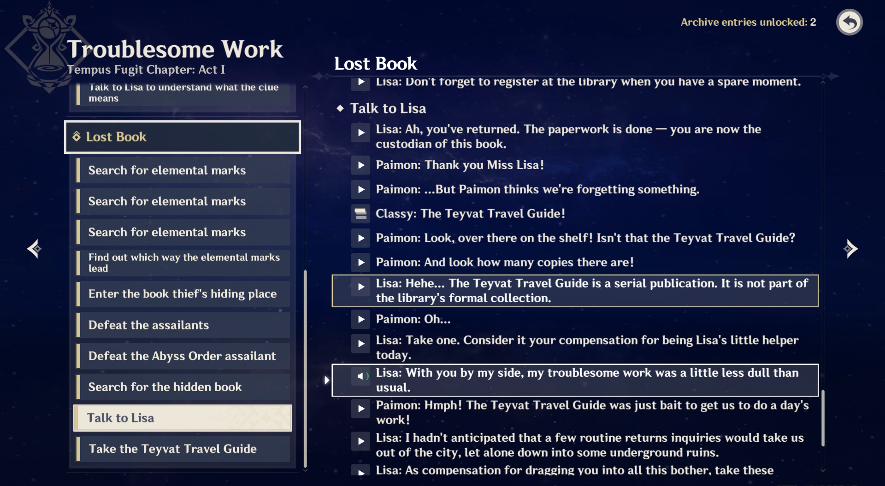
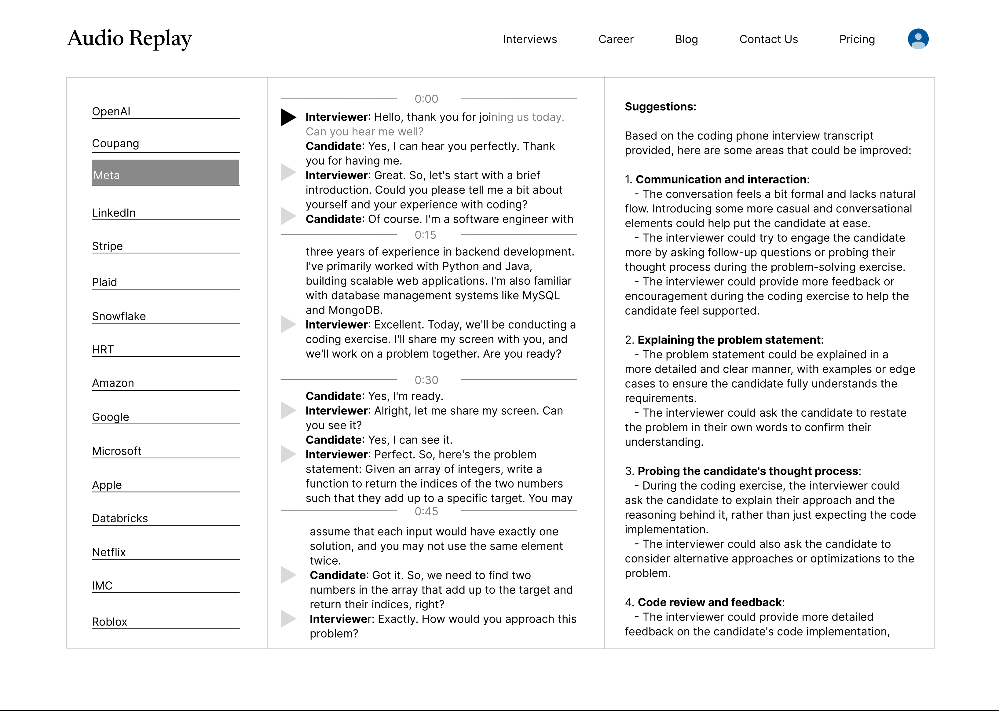

# Audio Replay
This is a front-end mockup for an interactive dashboard that reviews audio recordings of interview sessions.
This dashboard serves as a platform for users to analyze interview recordings efficiently, 
leveraging a user-friendly interface to navigate through an hour-long audio recording.

## Design
The design was inspired by other existing audio replay interfaces, example:

With this in mind, I came up with a similar design:

## Presentation:
Some of the key items that can help present data and insights:
1. The content is presented in a left to right detail hierarchy. This is a familiar item detail opening sequence to many people, doing common tasks like delving into nested folder to find a file.
2. Currently selected list item is highlighted in reverse color scheme, making it easy to see current selection.
3. Audio transcript is separated into 4 sections by default. Future adjustments can be made to dynamically group relevant sections.
4. Play button is in front of each audio segment for easy access to that specific audio segment by timing mark.
5. When the audio is playing, the text changes color to reflect current audio position. This is optional, and alternatively the play button can be changed to speaker icon for when audio is playing.
6. AI suggestions is displayed on the right, keeping pace with currently playing audio segment. This data can be changed dynamically to reflect focus on currently playing audio.
## Implementation:
The application utilizes:
1. Next.js for displaying the page
2. shadcn/ui for making each panel a scrollable area
3. react-icons for the play button

Application code was initialized manually to get a basic project folder structure in place,
and it's then populated by Claude 3 Sonnet.